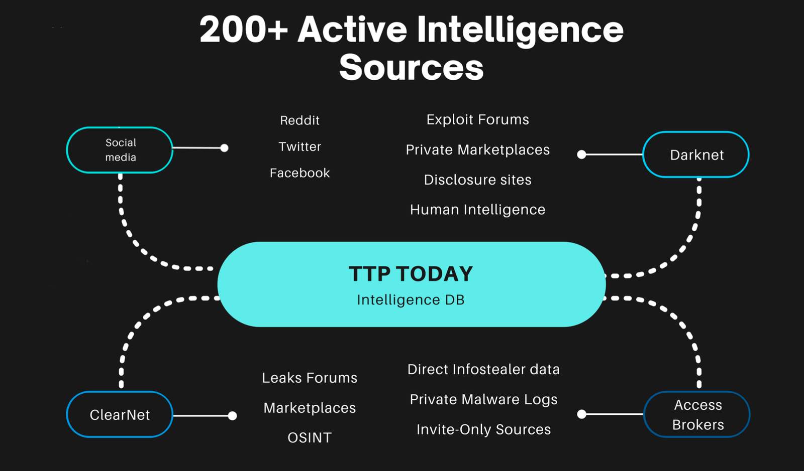

# LeaksAPI-Docs
http://leaks-api.com docs

  


 💧 LeaksAPI 💧 – Tap into the World of Data Breaches 🔍


LeaksAPI is an API that allows you to quickly discover if a user has been involved in a database or credentials leak or breach, helping protect users and enhance security systems worldwide.

Recover your old accounts, discover leaked passwords and more with LeaksAPI!

✅ Access Data From Over 1,340+ Leaked Databases and Breaches ✅  
🕵️ Quickly Check if a User's Password Has Been Leaked 🔑  
📊 Over 345.2 Million Infostealer Logs 📊  
🚀 Live Daily Updates 🚀  
🚨 Email notification alerts when your data is leaked 🚨  
💼 Pro Plan: Unlock passwords,address,dob, and much more with full access to infostealer logs 💼  
📧 Best with Gmail, Hotmail, or Business Emails/domains 📧  
🛡️ Empower your cybersecurity strategy with actionable insights from LeaksAPI 🛡️  

**Total: Over 345.2 million infostealer infection logs + 1,340+ leaked databases indexed**  

<a href='http://leaks-api.com'>SIGN UP NOW!</a>
details; 
 
emails-full-unique.py - increment results using offset until no more are found, unique and save to file (uses around 5-10 credits per full deep domain search)    
add your key 'your key here' in the script   

```
% python3 emails-full.py example.com
[*] Requesting offset 0–1000 for example.com...
[+] Emails found in this batch: 1000

[*] Requesting offset 1000–2000 for example.com...
[+] Emails found in this batch: 1000

[*] Requesting offset 2000–3000 for example.com...
[+] Emails found in this batch: 1000

[*] Requesting offset 3000–4000 for example.com...
[+] Emails found in this batch: 1000

[*] Requesting offset 4000–5000 for example.com...
[+] Emails found in this batch: 1000

[*] Requesting offset 5000–6000 for example.com...
[+] Emails found in this batch: 1000

[*] Requesting offset 6000–7000 for example.com...
[+] Emails found in this batch: 1000

[*] Requesting offset 7000–8000 for example.com...
[+] Emails found in this batch: 1000

[*] Requesting offset 8000–9000 for example.com...
[+] Emails found in this batch: 1000

[*] Requesting offset 9000–10000 for example.com...
[+] Emails found in this batch: 1000

[*] Requesting offset 10000–11000 for example.com...
[+] Emails found in this batch: 1000

[*] Requesting offset 11000–12000 for example.com...
[+] Emails found in this batch: 0
[!] No more emails found. Stopping.

[✓] Total unique emails found for example.com: 5466
[✓] Saved to: unique-example.com.txt
```


endpoints;  

1. passwords-premium-subscription  

Returns: Passwords, IPs, phone numbers, address, DOB, SSN, and more  
Method: GET  
URI: /api/v2/query/{email}  
Example:  
```
curl --request GET \
  --url 'https://leaksapi.p.rapidapi.com/api/v2/query/test@gmail.com' \
  --header 'x-rapidapi-host: leaksapi.p.rapidapi.com' \
  --header 'x-rapidapi-key: YOUR_API_KEY'
```


2. domain-search 
Returns: Leaked data for entire corporate domain  
Method: GET  
URI: /api/v2/query/{domain}  
parameter = type=domain  
if none provided, it will auto attempt to auto identify but you should specify domain its better  

Example curl request and response:  
```
curl --request GET \
  --url 'https://leaksapi.p.rapidapi.com/api/v2/query/example.com?type=domain' \
  --header 'x-rapidapi-host: leaksapi.p.rapidapi.com' \
  --header 'x-rapidapi-key: x'
```

```
< HTTP/2 200 
< date: Fri, 27 Jun 2025 03:10:06 GMT
< content-type: application/json
< x-ratelimit-commercial-full-domain-search-remaining: 939995
< x-ratelimit-commercial-full-domain-search-reset: 17960
< server: RapidAPI-1.2.8
< x-rapidapi-version: 1.2.8
< x-rapidapi-region: AWS - eu-west-1
< 
{
  "found": 1000,
  "result": [
    {
      "email": "somebody@example.com",
      "fields": [
        "password",
        "email"
      ],
      "password": "1$RHLJ57vRhgI",
      "source": {
        "name": "Unknown"
      }
    },
    {
      "first_name": "samynl",
      "fields": [
        "password",
        "first_name",
        "username",
        "email"
      ],
      "source": {
        "compilation": 0,
        "passwordless": 0,
        "breach_date": "2013-11",
        "name": "xSplit",
        "unverified": 0
      },
      "password": "123456",
      "username": "samynl",
      "email": "somebody@example.com"
    },
```

  1350+ leaked database, and 360 million infostealer log collect via TTPToday's in-house developed intelligence stream   

  


  pricing:
  See dynamic pricing page <a href='http://leaks-api.com'>HERE </a> or contact us for a quote 
  price point is around 999$ per 10 RPS upgrade to your plan, otherwise max is 3 requst per second, contact us for custom quotes and integrations 
  i.e 20 RPS extra is 999 x 2 = 1998
  we cant discount it as its the cost of our dedicated servers to you but you are gurenteed the resources + aws load balncing with 0.00% error rate, RPS arent profit for us its the best we can do

